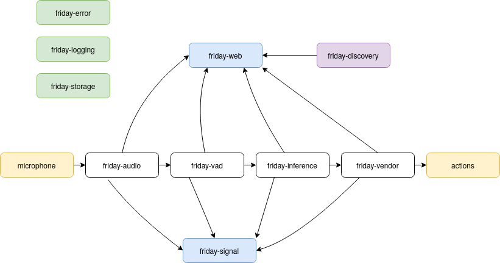

Friday is a keyword spotting based voice assistant. The main feature is that it is wake word free, offline and uses few-shot learning to add new keywords. 

- [Try it Out](#try-it-out)
- [Contributing](#contributing)
- [Architecture](#architecture)

TODO.. Demo

# Try it Out

Follow one of the platform guides to set it up. 

- [Guide for Linux](releases/LINUX-x86.md)
- [Guide for Raspberry-Pi 3](releases/RASPBERRY-PI-3.md)

## Contributing

Contributions are welcome. Help with general documentation, contributions of [models](mm), contributions to [core assistant code](friday) or contributions to the [user-interface](web/becky) are most welcome. Although it might be hard to start contributing directly because of a lack of documentation. An attempt of a project overview is given in the following section:

### Architecture

Friday consists of three components

1. [Assistant Binary](#friday-binary), found in [friday](friday)
2. [Model Development](#models), found in [mm](mm)
3. [GUI](web/becky), found in [web](web/becky)

### Friday Binary

The main binary found under [/friday](friday) contains the following modules

audio is recorded with **friday-audio**, **friday-vad** is a low resource barrier to **friday-inference**. **friday-vendor** executes keywords spotted by **friday-inference**. Each module uses the utility modules **friday-error**, **friday-logging** and **friday-storage** for persistance, logging and error handling. Each module also implements endpoint via **friday-web** which is used to get information and set information via an API. This enables adding keywords and configuring the assistant via a WebGUI. **friday-discovery** exposes functionality to make finding the assistant eaiser. **friday-signal** is under development but is ment to be used by the assistant to send physical signals, such as noise or light to indicate to the user at what stage of the inference pipeline Friday is at.

