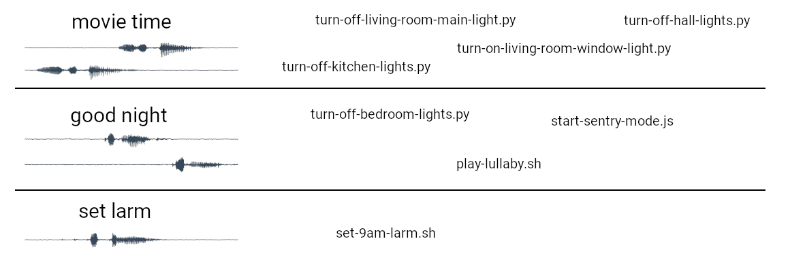

Friday is a special kind of voice assistant, it is not very smart, all it does is execute scripts when it spots key-phrases. Friday is based on a few-shot learning method that enables it to learn new key phrases from just one example, although providing a few does not hurt. 

By combining scripts you can make pretty cool things happend, Friday also ships with a [GUI](web/becky/) to make adding keywords and binding them to scripts easier.

- [Try it Out](#try-it-out)
- [Contributing](#contributing)

TODO.. Demo

# Try it Out

Follow one of the platform guides to set it up. The raspberry pi guide is the most comprehensive and contains information that might be useful for other platforms as well.

- [Guide for Raspberry-Pi 3](releases/RASPBERRY-PI-3.md)
- [Guide for Linux](releases/LINUX-x86.md)

## Contributing

This is mainly a project for building an assistant that I myself use, but contributions are welcome that would make it usable for others. Help with general documentation, contributions of [models](mm), contributions to [core assistant code](friday) or contributions to the [user-interface](web/becky) are most welcome. Although it might be hard to start contributing directly because of a lack of documentation. An attempt of a project overview is given in [architecture](architecture.md).

