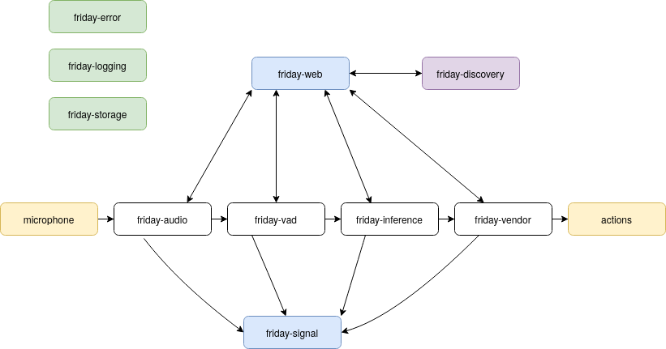

Friday is a keyword spotting based voice assistant. The main feature is that it is wake word free, offline and uses few-shot learning to add new keywords. 

- [Features](#features)
- [Demo](#demo)
- [Installation](#installation)
- [Releases](#releases)
- [Contributing](#contributing)
- [Architecture](#architecture)

## Demo

TODO..

## Installation

Installation has been tested on the following platforms, using rusts cross-compilation tools

- [Raspberry Pi 3](releases/INSTALL-RASPBERRY-PI-3.md)
- [Linux x86](releases/INSTALL-LINUX-x86.md)

## Releases

TODO..

## Contributing

Any and all contributions are welcome - preferably through a PR. 

## Architecture

The Friday project consists of three components

1. [friday binary](#friday-binary), found in [friday](friday)
2. [model development](#models), found in [mm](mm)
3. [guis & web](#gui-&-web), found in [web](web)

### Friday Binary

The main binary found under [/friday](friday) contains the following modules

- [friday inference](friday/friday-inference)
- [friday vad](friday/friday-vad)
- [friday web](friday/friday-web)
- [friday storage](friday/friday-storage)
- [friday vendor](friday/friday-vendor)
- [friday audio](friday/friday-audio)
- [friday discovery](friday/friday-discovery)
- [friday signal](friday/friday-signal)
- [friday logging](friday/friday-logging)
- [friday error](friday/friday-error)

the error, logging and storage modules are used by all other modules for things such as logging, error handling and loading / storing configurations or other files. Moreover, Friday has 3 main logic flows. 

1. Inference flow
2. Web flow
3. Discovery flow

Each flow runs in separate threads.

The **inference flow** 

1. read audio chunk using some implementation of the [Recorder trait](friday/friday-audio/src/recorder.rs) in **friday-audio**. 
2. Use  **friday-vad** (voice activity detection) an implementation of [SpeakDetector trait](friday/friday-vad/src/core.rs).
3. If **friday-vad** determines audio to contain no voice - return to 1.
4. Use **friday-inference** an implementation of [Model trait](friday/friday-inference/src/lib.rs) to find what, if any, keyword is in speech.
5. If **friday-inference** finds no keyword - return to 1.
6. Use **friday-vendor** to dispatch commands to all known vendors. Anything implementing the [Vendor trait](friday/friday-vendor/src/lib.rs) can dispatch actions.

The **Web flow**

Each of the modules in the inference flow also exposes web endpoints. The audio module exposes endpoint to record audio and store it as files on the assistant. Implementations of models have their own specific endpoints as well and implementations of vendors too. All of these endpoints are used to get information about the inference flow and to modify its components, for example by adding keywords to implementations of inference or by connecting keywords to implementations of vendors. The web flow also serves a website that can interact with Fridays API and function as a GUI.

The **Discovery flow**

This flow is supposed to make usage of friday easier e.g helping to connect to wifi and finding the GUI etc. Currently it only does one thing, every 1 hour it pings https://discoverfriday.se and it sends its name and local IP, so that one can find any devices on your local network by visiting https://discoverfriday.se 

### Models 

Models are developed under mm/

### Gui & Web

The latest web gui, that I myself use is [nightout](web/nightout), there is no API documentation at the moment. But [this file](web/nightout/src/FridayAPI.js) contains a majority of the API endpoint to talk to friday.
