# Becky

Becky is a frontend for Friday, named by [markusaj13](https://github.com/Markusaj13). It enables you to bind scripts to keywords and add new keywords through a graphical user interface.

- [Adding Keywords](#adding-keywords)
- [Adding Commands](#adding-commands)

### Adding Keywords

On the landing page you can navigate to the keywords by pressing the voice icon in the bottom navbar. The keyword page shows all recorded keywords. One can add a keyword and record examples for it in the UI.

 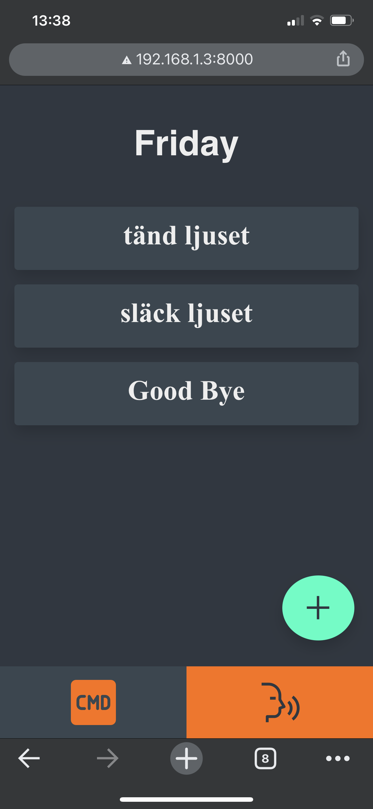
 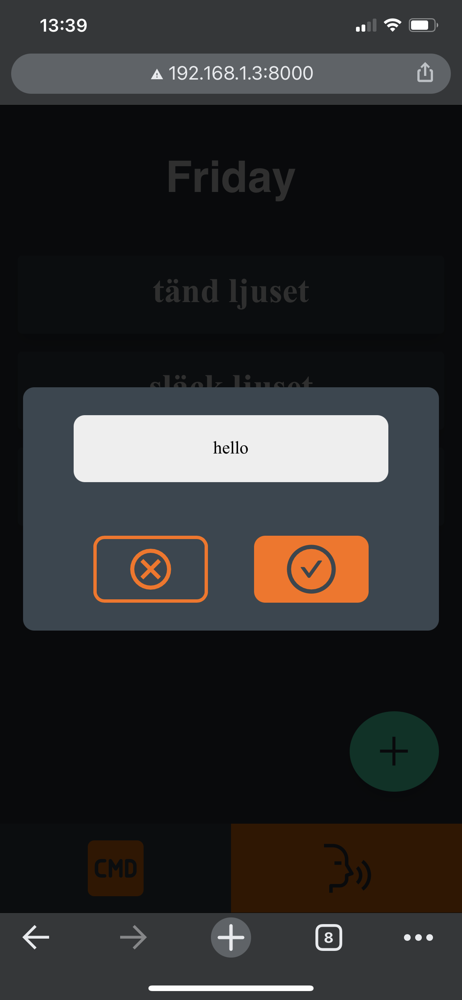
 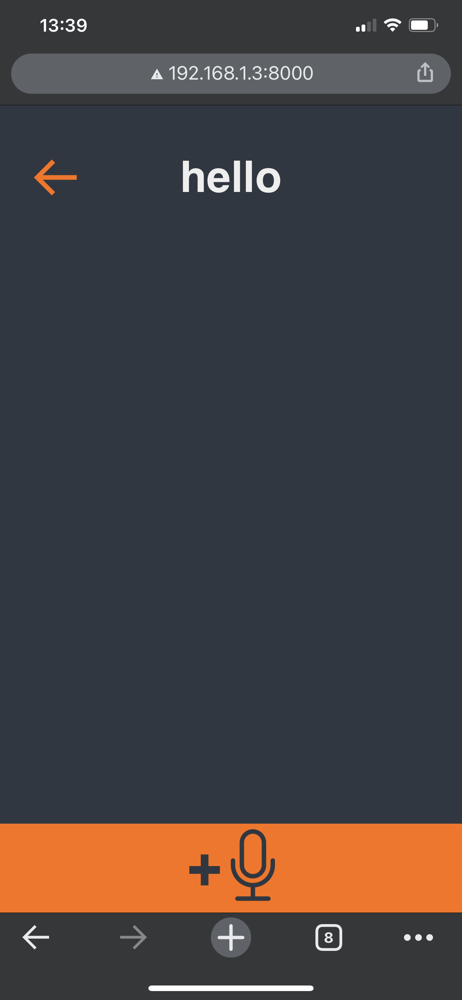
 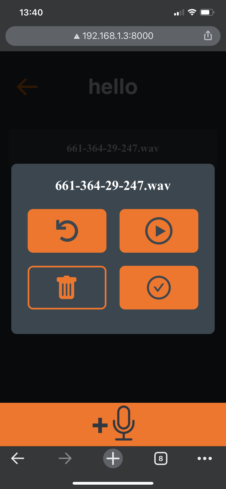
 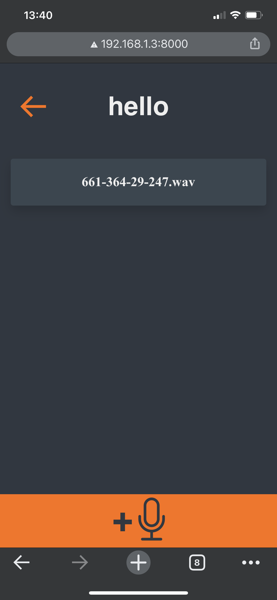
 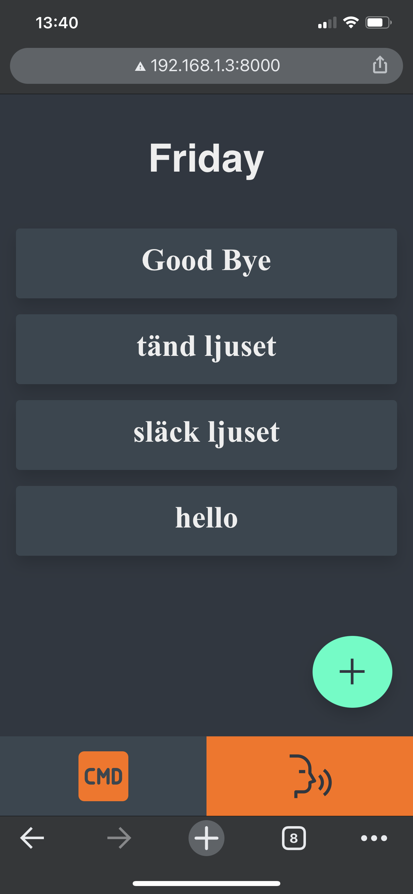

 
 
Typically you want to record multiple examples per keywords, say around 5, with varying pronounciation and position. You can record more examples for existing keywords by pressing an existing keyword bar.

### Adding Commands

A command is a keyword bound to a set of scripts. You can enter the command editor for an existing keyword by pressing its command bar.

  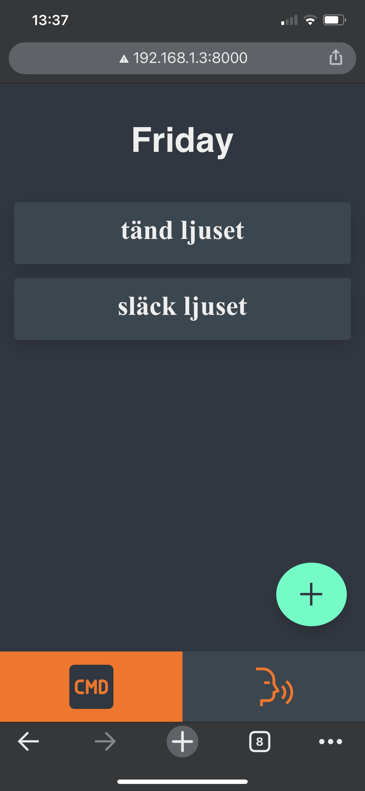
  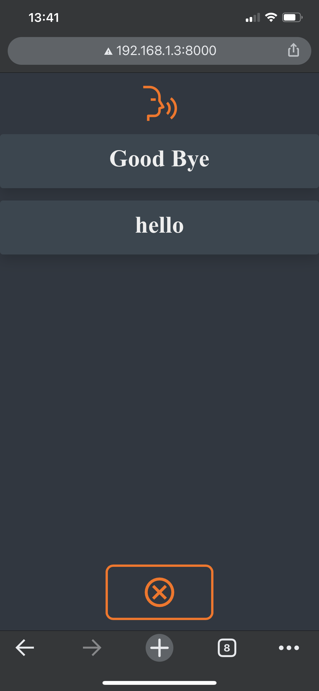
  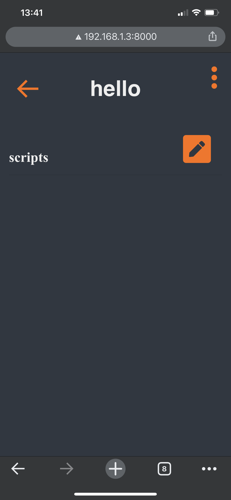
  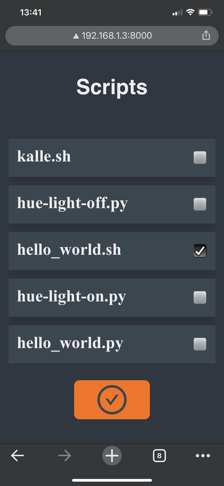
  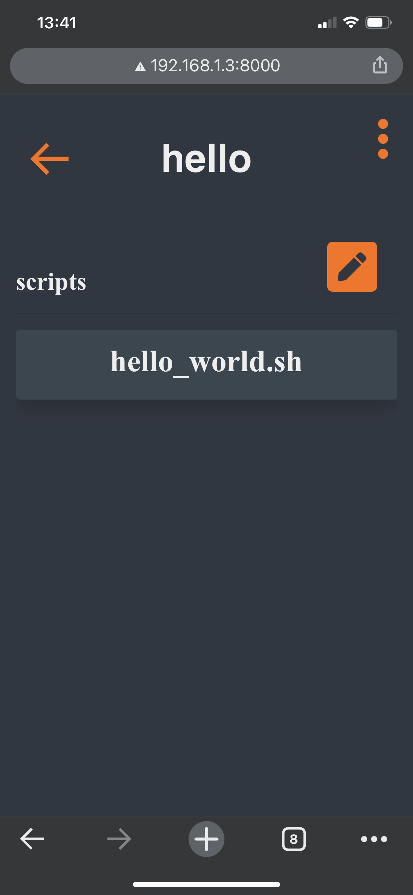
  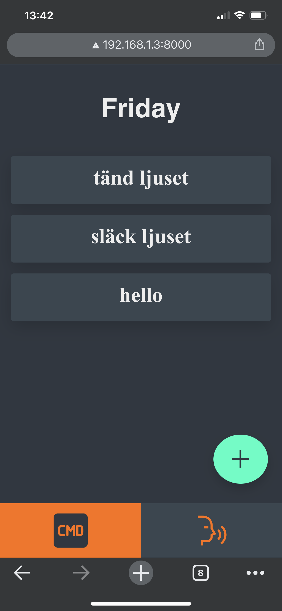

